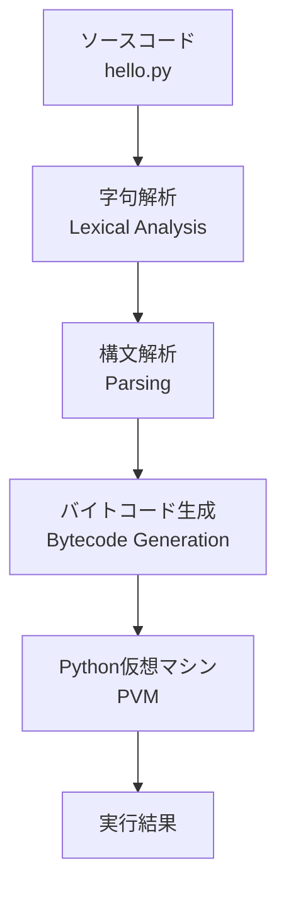

# 第2章：Python環境のセットアップと実行の仕組み

## この章で学ぶこと

- Pythonのインストール方法（Windows、macOS、Linux）
- 対話型シェル（REPL）の詳しい使い方
- テキストエディタとIDEの選び方
- Pythonプログラムファイルの作成と実行
- Pythonインタプリタが何をしているか

## 2.1 Pythonのインストール

### Windows

1. [python.org](https://www.python.org/downloads/)にアクセス
2. 「Download Python 3.x.x」ボタンをクリック
3. ダウンロードしたインストーラーを実行

!!! warning "重要な設定"
    インストーラーの最初の画面で「Add Python to PATH」に必ずチェックを入れてください！
    これを忘れると、コマンドプロンプトから`python`コマンドが使えません。

### macOS

macOSには古いバージョンのPython 2.xがプリインストールされていますが、新しいPython 3.xをインストールしましょう。

#### Homebrewを使う方法（推奨）

```bash
# Homebrewがない場合は先にインストール
/bin/bash -c "$(curl -fsSL https://raw.githubusercontent.com/Homebrew/install/HEAD/install.sh)"

# Python 3をインストール
brew install python3
```

#### 公式インストーラーを使う方法

1. [python.org](https://www.python.org/downloads/)からmacOS用インストーラーをダウンロード
2. .pkgファイルを実行してインストール

### Linux (Ubuntu/Debian)

```bash
sudo apt update
sudo apt install python3 python3-pip python3-venv
```

### インストールの確認

ターミナル（コマンドプロンプト）を開いて以下を実行：

```bash
$ python3 --version
Python 3.11.0

$ python3 -c "print('Hello, Python!')"
Hello, Python!
```

## 2.2 対話型シェル（REPL）の詳しい使い方

### REPLの起動と終了

```bash
$ python3
Python 3.11.0 (main, Oct 24 2022, 18:26:48) [MSC v.1933 64 bit (AMD64)]
Type "help", "copyright", "credits" or "license" for more information.
>>> 
```

終了するには：
- `exit()` または `quit()` を入力
- Ctrl+D（macOS/Linux）またはCtrl+Z → Enter（Windows）

### 便利な機能

#### 1. ヘルプの表示

```python
>>> help(print)
Help on built-in function print in module builtins:

print(...)
    print(value, ..., sep=' ', end='\n', file=sys.stdout, flush=False)
    
    Prints the values to a stream, or to sys.stdout by default.
```

#### 2. 補完機能

多くの環境では、Tabキーで補完が効きます：

```python
>>> pri[Tab]  # printに補完される
>>> print
```

#### 3. 履歴機能

上下矢印キーで過去に入力したコマンドを呼び出せます。

#### 4. 複数行の入力

```python
>>> if True:
...     print("インデントが必要")
...     print("これも同じブロック")
... 
インデントが必要
これも同じブロック
```

`...`は続きの行を入力することを示しています。

## 2.3 テキストエディタとIDEの準備

プログラムをファイルに保存して実行するには、テキストエディタが必要です。

### 初心者向けのおすすめ

#### Visual Studio Code（推奨）
- 無料で高機能
- Python拡張機能で強力な支援機能
- [code.visualstudio.com](https://code.visualstudio.com/)からダウンロード

インストール後、Python拡張機能を追加：
1. 左側の拡張機能アイコンをクリック
2. 「Python」を検索
3. Microsoftの「Python」拡張機能をインストール

#### PyCharm Community Edition
- Python専用の統合開発環境（IDE）
- 初心者にも使いやすい
- [jetbrains.com/pycharm](https://www.jetbrains.com/pycharm/)からダウンロード

### シンプルなテキストエディタ

もっとシンプルなものが好みなら：
- **Windows**: メモ帳（ただし機能は限定的）
- **macOS**: テキストエディット（プレーンテキストモードで）
- **Linux**: gedit、nano

## 2.4 【実行】はじめてのプログラムファイル作成と実行

### プログラムファイルの作成

1. テキストエディタを開く
2. 以下のコードを入力：

```python
# hello.py
# 私の最初のPythonプログラム

print("Hello, World!")
print("プログラミングの世界へようこそ！")

# 簡単な計算
answer = 40 + 2
print(f"人生、宇宙、すべての答えは {answer} です")
```

3. `hello.py`という名前で保存

!!! note "ファイル名について"
    - Pythonファイルの拡張子は`.py`
    - ファイル名は英数字とアンダースコア（_）を使う
    - スペースは避ける（hello_world.pyは○、hello world.pyは×）

### プログラムの実行

ターミナルで保存したディレクトリに移動し、実行：

```bash
$ cd /path/to/your/file
$ python3 hello.py
Hello, World!
プログラミングの世界へようこそ！
人生、宇宙、すべての答えは 42 です
```

### エラーが出た場合

```bash
$ python3 hello.py
python3: can't open file 'hello.py': [Errno 2] No such file or directory
```

このエラーは、現在のディレクトリにhello.pyがないことを意味します。

対処法：
1. `ls`（Windows: `dir`）でファイル一覧を確認
2. `cd`コマンドで正しいディレクトリに移動
3. または、フルパスで指定：`python3 /full/path/to/hello.py`

## 2.5 Pythonインタプリタが何をしているか

### プログラムの実行プロセス

Pythonプログラムを実行すると、以下のような処理が行われます：



1. **字句解析（Tokenization）**: ソースコードを「トークン」という最小単位に分解
2. **構文解析（Parsing）**: トークンから構文木を作成
3. **バイトコード生成**: 構文木から中間コードを生成
4. **実行**: Python仮想マシン（PVM）がバイトコードを実行

### 実際に見てみよう

```python
# inspect_code.py
import dis

def hello():
    print("Hello, World!")

# バイトコードを表示
dis.dis(hello)
```

実行すると：

```bash
$ python3 inspect_code.py
  4           0 LOAD_GLOBAL              0 (print)
              2 LOAD_CONST               1 ('Hello, World!')
              4 CALL_FUNCTION            1
              6 POP_TOP
              8 LOAD_CONST               0 (None)
             10 RETURN_VALUE
```

これがPythonの中間言語（バイトコード）です！

!!! info "なぜこれを知る必要があるの？"
    普段のプログラミングでバイトコードを意識する必要はありません。
    しかし、Pythonがどのように動作するかを理解することで、
    より効率的なコードが書けるようになります。

### コンパイル型言語との違い

C言語のようなコンパイル型言語は、事前に機械語に変換されます。
一方、Pythonは：

1. **インタプリタ型**: 実行時に解析・実行
2. **動的型付け**: 変数の型を実行時に決定
3. **プラットフォーム独立**: 同じコードがWindows、macOS、Linuxで動作

## 2.6 Pythonファイルの実行オプション

### よく使うオプション

```bash
# 対話モードで実行後、REPLに入る
$ python3 -i hello.py

# モジュールとして実行
$ python3 -m hello

# 1行のコードを実行
$ python3 -c "print('Hello')"

# Pythonのパスを表示
$ python3 -c "import sys; print(sys.path)"
```

### シバン（Shebang）

Unix系システムでは、ファイルの先頭に以下を追加すると、直接実行できます：

```python
#!/usr/bin/env python3
# hello.py

print("Hello, World!")
```

```bash
$ chmod +x hello.py
$ ./hello.py
Hello, World!
```

## 2.7 仮想環境（Virtual Environment）

プロジェクトごとに独立したPython環境を作ることができます：

```bash
# 仮想環境の作成
$ python3 -m venv myenv

# 有効化
$ source myenv/bin/activate  # macOS/Linux
$ myenv\Scripts\activate     # Windows

# 無効化
$ deactivate
```

!!! note "なぜ仮想環境を使うの？"
    - プロジェクトごとに異なるパッケージバージョンを管理
    - システムのPython環境を汚さない
    - 依存関係の衝突を避ける

## 2.8 この章のまとめ

- Pythonは公式サイトから簡単にインストールできる
- REPLは対話的にPythonを試すのに便利
- プログラムはテキストファイルに保存して実行する
- Pythonインタプリタはソースコードを解析してバイトコードに変換し、実行する
- 仮想環境を使うとプロジェクトごとに環境を分離できる

## 練習問題

1. **環境構築**
   - Pythonをインストールし、バージョンを確認してください
   - お好みのテキストエディタをインストールしてください

2. **プログラムファイルの作成**
   - 自己紹介をするプログラム`introduction.py`を作成してください
   - 名前、年齢、趣味を変数に保存して表示してください

3. **エラーへの対処**
   - わざと構文エラーのあるプログラムを作成し、実行してみてください
   - エラーメッセージから問題を特定し、修正してください

4. **仮想環境の練習**
   - `test_env`という名前の仮想環境を作成してください
   - 有効化して、`python --version`でバージョンを確認してください

---

次章では、いよいよPythonプログラムの構造について学び、BNF記法の基礎を導入します。

[第3章 Pythonプログラムの構造と実行 →](../part2/chapter03.md)